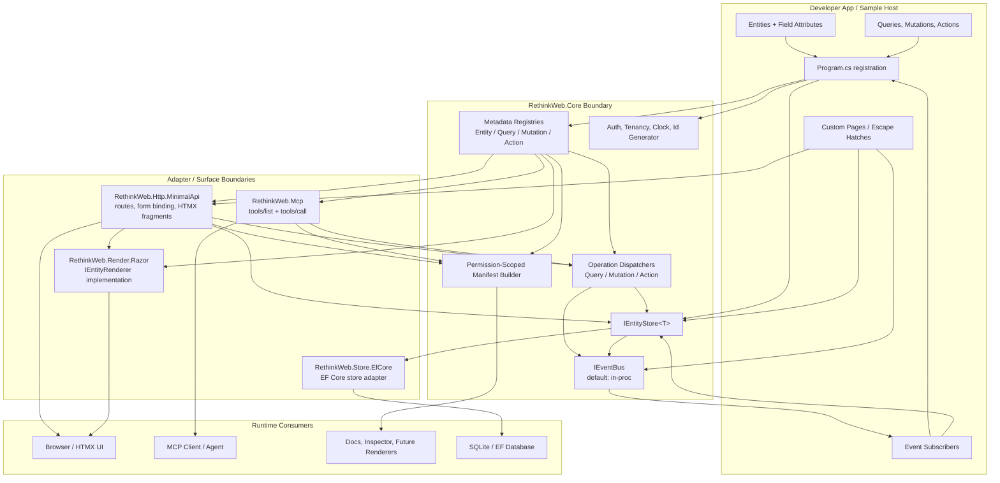
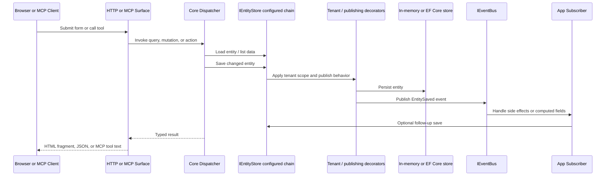

# Architecture Boundaries

This diagram shows RethinkWeb as an app-manifest runtime: app code defines the business contract, `RethinkWeb.Core` owns the runtime model and extension points, and adapter packages expose that model through web, MCP, rendering, and storage surfaces.

## Boundary Rules

`RethinkWeb.Core` is the center of gravity. It owns metadata, registries, manifest generation, operation dispatch, event contracts, tenancy/auth abstractions, and the `IEntityStore<T>` contract. It should not know about ASP.NET endpoints, Razor rendering, MCP transport, or EF Core.

Surface packages are opt-in adapters. `Http.MinimalApi`, `Render.Razor`, `Mcp`, and `Store.EfCore` each depend on `Core` plus their external framework. They should translate the core app contract into a surface, not smuggle surface assumptions back into core.

The manifest is the public contract. Browser UI, MCP clients, docs, inspectors, and future renderers should consume runtime metadata or the manifest instead of scraping generated HTML.

Storage is deliberately narrow. App code talks to `IEntityStore<T>` unless it needs an escape hatch, and adapter packages can replace the default in-memory store with EF Core or future stores without changing the operation model.

## Save And Operation Flow

The slightly sharp edge: the same action or mutation can be reached through generated HTTP endpoints and MCP tools. That only works because both surfaces go through the same registries, dispatchers, store contract, and event pipeline. If a new surface bypasses those, it creates drift.
